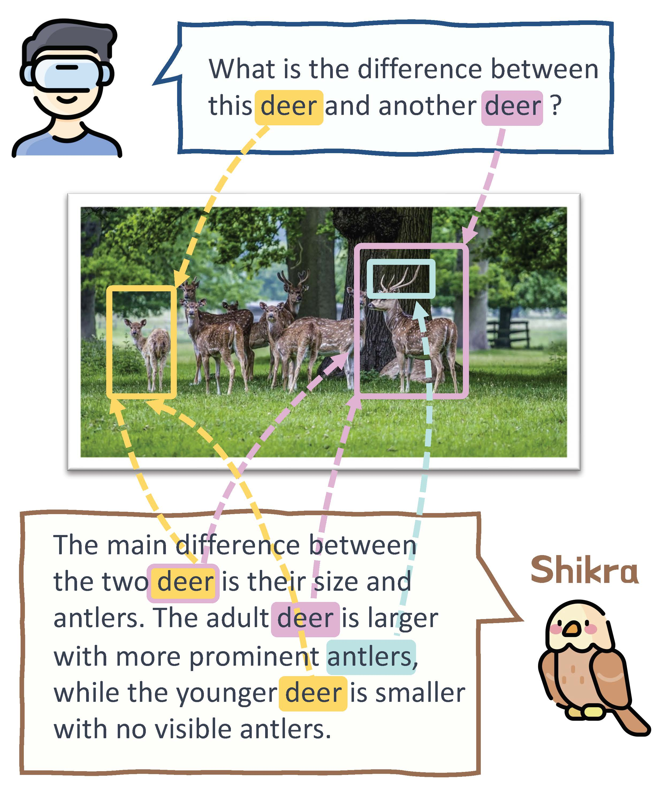
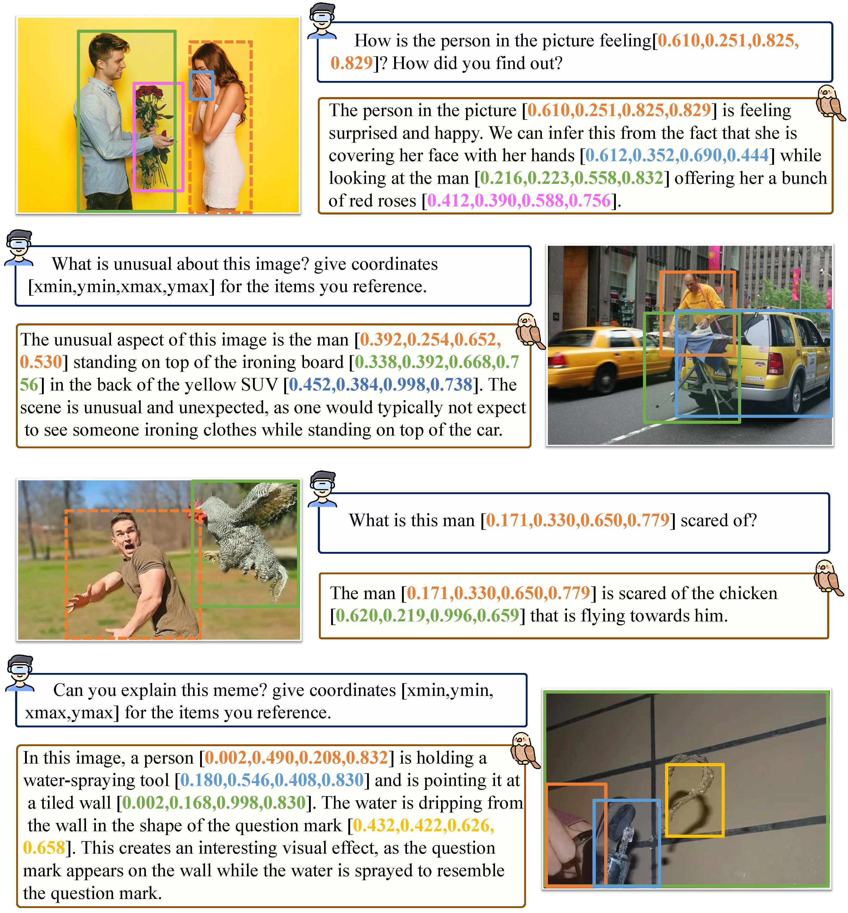

  
  <h4 align="center">Shikra: Unleashing Multimodal LLM’s Referential Dialogue Magic</h4>
  

    
    
  

***
**Shikra**, an MLLM designed to kick off **referential dialogue** by excelling in spatial coordinate inputs/outputs in natural language, **without** additional vocabularies, position encoders, pre-/post-detection, or external plug-in models.

## News
[06/28/2023] We will release our model before this weekend 07/02/2023.

## Examples

